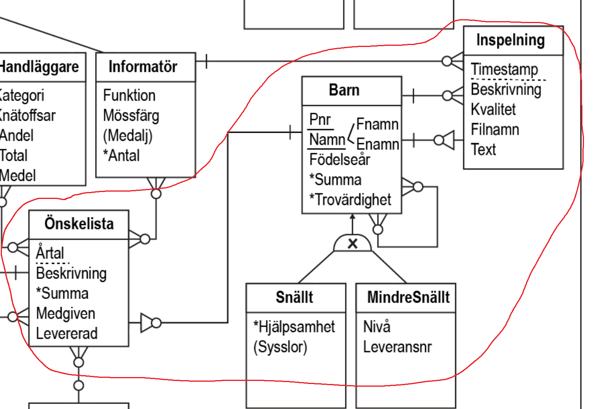

# Databaskonstruktion

## Introduktion

Nyheterna har de senaste månaderna visat många bilder från nordpolen på hur tomtenissarna
protesterar mot att årets planering av julklappsutdelningen har havererat. Verksamheten har växt,
fler barn och fler önskningar vilket gjort att tomtefar har haft svårt att hinna med att planera
utdelningen av barnens paket. När julafton nu närmar sig så vet ingen om tomten har tillräckligt
med leksaker eller om nissarna har producerat för få leksaker, eller om tomten har tillräckligt
med renar för att kunna leverera alla paketen. Tomten har ett helt analogt system bestående av
papperslappar som han sparar i sin luva. Din uppgift som konsult med specialkunskaper inom
databas-området är att implementera en prototyp för det tänkta informationssystemet. Nissarna
har på nissars vis, på ett högst kaotiskt vis, skapat en kravspecifikation tillsammans med ett antal
systemutvecklings-konsulter. Nissarna och konsulterna har sedan en tid arbetat med att analysera
myndighetens verksamhet och skriva en kravspecifikation som beskriver hur de arbetar. Din
uppgift är att använda specifikationen för att skapa en prototyp. Prototypen ska användas för att
utvärdera möjligheterna hos det nya systemet innan det kompletta systemet implementeras.
Endast en funktionellt sammanhållen delmängd skall implementeras exv. en användarkategori
eller ett användningsscenario. Samma scenario som valts ut för implementation skall sedan
implementeras med PHP och .net. Det är av högsta vikt att alla delar, databas,
klient-funktionalitet och användargränssnitt implementeras så att prototypen effektivt kan
utvärderas mot verksamheten vad gäller bland annat prestanda och användarvänlighet.
Kravspecifikationen innehåller endast knapphändig information om databas-systemets
användargränssnitt, implementationen bör dock trots detta försöka sträva mot att skapa ett
användargränssnitt som är så lättanvändligt som möjligt då stora delar av personalen har mycket
begränsade datorkunskaper (tomtenissar). Dokumentationen (i form av en rapport om
implementationen) av systemet är av högsta vikt eftersom en utvärdering av prototyperna ska ske
nästan uteslutande från den skapade dokumentationen.

## ER Image

Studenten ska välja 20% utav en ER modell och valde där med:

 

## Tabell Barn 

I databasen finns två typer av barn, snälla barn och mindre snälla barn. Samma barn kan inte vara
både ett snällt barn och ett mindre snällt barn. Handläggarna bör oftare medge önskelistor till
barn som är snälla och mera ofta avslå önskelistor från de mindre snälla barnen. Handläggaren
bestämmer utifrån egna avvägningar när detta sker, men en användare ska inte manuellt behöva
flytta data när ett barn går från att vara snällt till att exempelvis vara mindre snällt. Varje barn
skall ha möjligheten att skriva en längre textbeskrivning om sin hemsituation exv “Ny söt
lillebror, surt läge.”.
Det ska vara möjligt att uppskatta trovärdigheten på respektive barn av typen “snällt barn”
genom att beräkna ett medelvärde på kvaliteten på alla barnets inspelningar plus antalet
genomförda sysslor om barnet hör till typen snälla barn. Ett barn av typen mindre snällt barn ska
få en trovärdighet baserad på medelvärdet på kvaliteten på inspelningarna men minus något fast
värde så att ett snällt barn med samma medelvärde och utan sysslor får en högre trovärdighet än
ett mindre snällt barn. Det ska även gå att beräkna en totalsumma på kostnaden av alla julklappar
respektive barns alla önskelistor.
Barnen registrerar sig själva med sitt födelseår samt sitt unika namn som består av förnamn och
efternamn samt barnets unika barn-pnr, vilket utgörs av fyrsiffrigt löpnummer följt av en 6-siffrig
regionskod, och slutligen en fyrsiffrig datum-kod (0520 för maj 2020).
Ett barn kan ha skrivit flera önskelistor, men maximalt en önskelista varje år. Ett barn kan ha
gjort noll eller flera inspelningar / inlägg och ett barn kan vara utpekas i för noll eller flera
inspelningar. Ett barn kan även vara relaterat till flera olika barn. För varje sådan koppling
mellan två barn lagras hur barnen är relaterade exv “syskon”, “kusin”, “dagis-kollega”.
Snälla barn: För de snälla barnen ska en beskrivning av vilka sysslor barnen genomfört och till
vilken grad barnen fullgör sysslorna, beskrivet av nivåerna “Undermåligt”, “Klåparmässigt”,
“Klantigt” och “Lyckat”. För snälla barn ska det gå att beräkna ett hjälpsamhetsvärde genom att
räkna de sysslor som är klantigt genomförda eller bättre.
Mindre snälla barn: För de mindre snälla barnen lagras en nivå på hur olydiga barnen varit.
Värdet representeras av en färg från grönt till rött, lagrat som ett tal mellan 0-114. Slutligen
7
lagras tracking-numret för det senaste kol-stycket som tomten levererat om barnet haft en
o-snällhetsnivå över 95%.

## Antagande

Barn är antingen snäll eller mindre snäll och därmed används Alternativ B på modellering. Alternativ B innebär att man skapar två tabeller och använder inte Barn som en tabell. Ex: Snäll(_PNR, _Namn, födelseår, Summa, trovärdighet, Hjälpsamhet) och mindreSnäll(_PNR, _Namn, födelseår, Summa, trovärdighet, Nivå, leveransNr). Nackdelen med att använda Alternativ B är hantering av partiella arv vilket inte används.

## Frågor att ställa

Ifall man har två stycken tabeller för snällt barn och mindre snällt barn, hur ska man spara främmande nyckel från barn i inspelning? Ska man spara följande FOREIGN KEY(PNR) REFERENCE snälltbarn och FOREIGN KEY(PNR) REFERENCE mindreSnälltbarn

Hur ska man hantera derived attributes? T.ex. summa 